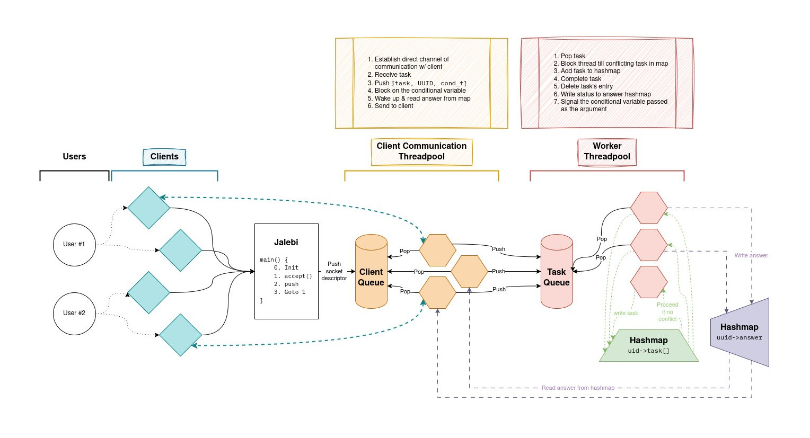

# Jalebi



### Dependencies

- GNU Readline
- libbsd
- SQLite3
- OpenSSL
- libuuid

#### Arch

```bash
sudo pacman -S lib32-sqlite lib32-openssl readline libbsd util-linux
```

#### Debian

```bash
sudo apt install libsqlite3-dev libssl-dev libreadline-dev libbsd-dev uuid-dev
```

### Usage

```bash
make all
./jalebi      # server
./namak-paare # client
```

### Todo

- [ ] Thread monitoring - Restart killed threads, etc.
    - How to find out a thread's died?
- [ ] close() -> shutdown() for sockets?
- [ ] Signal handlers; gracefully deal w/ sockets/readline(?)/database/threadpool/etc.

### Credits

- [uthash](https://github.com/troydhanson/uthash)
